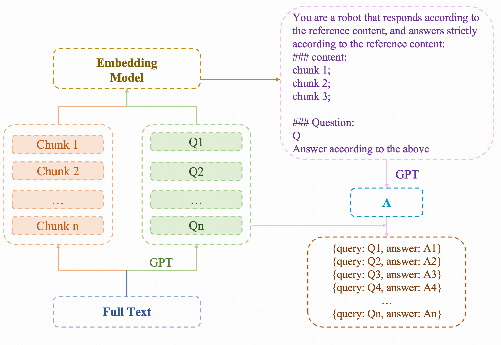

# Ref-QA

## 介绍
Ref-QA是self-QA的改进版本，通过引入知识大脑（Qwen2-72B）和向量库，实现更高效的问答和推理加速。Ref-QA将每个txt文件按照chunk_size进行切分，并增加前后覆盖，保证上下文连贯。然后，对每个chunk_size进行提问，收集10个query。接着，对chunk_size内容建立向量库，按照更小的块进行切分。将得到与query相似的片段作为上下文，调用api回答。最后，将answer与query作为训练数据，训练和评测工业大模型。

self-QA的改进版本Ref-QA：
1. Qwen2-72B模型作为知识大脑，进行问答，vllm进行推理加速，fastapi部署api访问
2. 对每个txt文件按照chunk_size进行切分，并增加前后覆盖，保证上下文连贯。
3. 对每个chunk_size进行提问，收集10个query
4. 对chunk_size内容建立向量库，按照更小的块进行切分
5. 将得到与query相似的片段作为上下文，调用api回答。收集answer
6. 将answer与query作为训练数据，训练和评测工业大模型

## 代码执行
1. vllm_llm.server.py: 部署qwen2-72b模型，访问api
2. client.py: 调用api进行问答
3. query_gen.py: 核心代码，整合query生成与检索。
4. retrival_doc.py: 检索文档。
5. prompt.py: 相关的Prompt指令。
